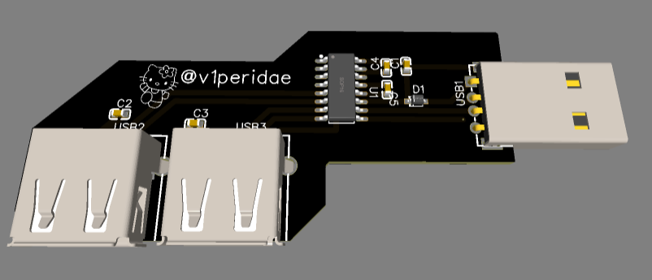
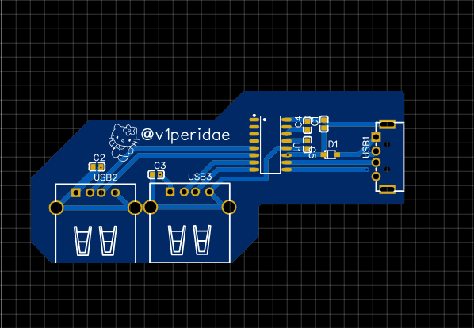

# USB Hub

This repo contains the files and documentation for a custom USB Hub PCB I created with the help of this Jam by Hack Club. 

## Features
- **Multi-Port USB Hub:** Supports not ONE but TWO USB-A ports.
- **Compact Design:** It's designed to be small.
- **Hello Kitty:** Self explanatory
  
## Schematic
The schematic for the USB Hub is included in the repository as a PDF, feel free to check those out and use them :)

## Pictures
### The 3D View

### The 2D View

